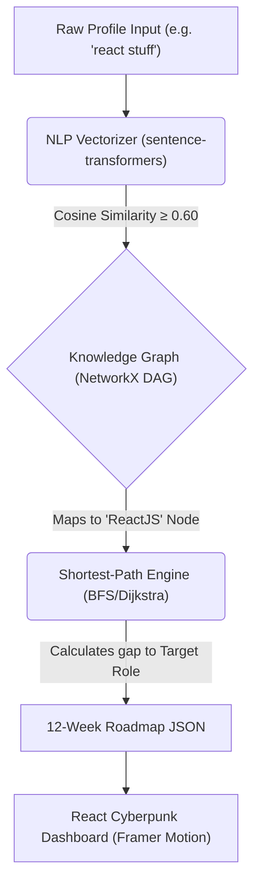

# 🚀 PLACEMENT PRO+

### Hybrid Neuro-Symbolic AI System for Personalized Career Roadmap Generation

<p align="center">
  
  
  
  
  
</p>

<p align="center">
  
  
  
  
  
</p>

---

## 📖 Overview

**Placement Pro+** is a production-grade AI platform that bridges the gap between academic preparation and enterprise industry requirements. It provides students with real-time placement probability scoring, AI-driven company matching, and **dynamically generated 12-week personalised growth roadmaps**.

The system operates **100% offline** — no paid APIs, no external LLM calls. It uses a proprietary **Neuro-Symbolic Layer**, merging the semantic understanding of Vector Embeddings with the mathematical precision of Directed Acyclic Graph (DAG) pathfinding.

---

## ✨ Feature Highlights

| Feature | Technology | Detail |
|---|---|---|
| 🧠 **Neuro-Symbolic AI** | `sentence-transformers` + `NetworkX` | Semantic skill mapping via cosine similarity + DAG shortest-path |
| 📊 **Placement Prediction** | Sigmoid-weighted heuristic model | Internships, CGPA, projects → 0–100% probability score |
| 🎯 **Company Matching** | Rule-based recommendation engine | CGPA gate + skill overlap scoring across 10+ companies |
| 📝 **12-Week Roadmap** | Knowledge graph pathfinding | Topologically ordered, gap-aware learning milestones |
| 🔐 **JWT Auth System** | `flask-jwt-extended` + `bcrypt` | Registration, login, token refresh, route protection |
| ⚡ **Intelligent Caching** | `cachetools.TTLCache` + `@lru_cache` | 4 TTL namespaces + memoized ML embeddings (leverages 24GB RAM) |
| 🛡️ **OWASP Security** | `flask-talisman` | HSTS, CSP, Referrer Policy, Feature Policy headers |
| 📈 **Observability** | Prometheus + Sentry + JSON Logging | `/metrics`, `/health`, `/ready`, structured request correlation IDs |
| 🐳 **Containerised** | Docker Compose | Multi-service, non-root images, health checks |
| 🔁 **CI/CD** | GitHub Actions | Lint → Test → Security scan → Docker build on every push |

---

## 🏗️ System Architecture



---

## 🚀 Quick Start

### Option 1: Docker Compose (Recommended)
```bash
git clone https://github.com/sriiverse/Placement-Pro.git
cd Placement-Pro
cp backend/.env.example backend/.env
docker compose up --build
```
- **Frontend:** http://localhost:5173
- **Backend API:** http://localhost:5000
- **Swagger UI:** http://localhost:5000/api/docs
- **Prometheus Metrics:** http://localhost:5000/metrics

### Option 2: Local Development

**Backend**
```bash
cd backend
python -m venv .venv && .venv/Scripts/activate   # Windows
pip install -r requirements.txt
cp .env.example .env
flask run
```

**Frontend**
```bash
cd frontend
npm install
npm run dev
```

---

## 🧪 Testing

```bash
# Run full test suite with coverage report
cd backend
pytest tests/ --cov=app --cov-report=term-missing

# Run only unit tests (fast — no DB)
pytest tests/ -k "TestML or TestSchema or TestCompany"
```

**Test Coverage Map**

| Module | Tests |
|---|---|
| `app/models.py` | ✅ Instantiation, `to_dict()`, FK links |
| `app/schemas.py` | ✅ Valid inputs, digit rejection, CGPA bounds, empty skills |
| `services/ml_service.py` | ✅ Probability range, ranking, null handling, confidence levels |
| `services/company_service.py` | ✅ Sort order, CGPA filter, null user, result keys |
| `app/auth.py` | ✅ Register, duplicate, short password, login, wrong password, JWT `/me` |
| `app/__init__.py` | ✅ `/health`, `/ready`, `/api/docs/openapi.json` |

---

## 🛡️ Security

The API enforces the following OWASP-recommended security controls:

- **HSTS** — `Strict-Transport-Security` header enforced
- **CSP** — `Content-Security-Policy` restricts scripts to `'self'` + Swagger CDN
- **Referrer Policy** — `strict-origin-when-cross-origin`
- **Feature Policy** — Geolocation, microphone, and camera disabled
- **Rate Limiting** — Per-endpoint via `flask-limiter` (brute-force protection on auth)
- **Pydantic v2 Validation** — Every input field validated before business logic runs
- **bcrypt** — Passwords hashed with work factor 12; same error for user-not-found vs wrong password (no enumeration)

---

## 📡 API Endpoints

| Method | Endpoint | Auth | Description |
|---|---|---|---|
| `GET` | `/health` | ❌ | Liveness probe |
| `GET` | `/ready` | ❌ | Deep readiness check (DB + cache + disk) |
| `GET` | `/metrics` | ❌ | Prometheus metrics |
| `GET` | `/api/docs` | ❌ | Swagger UI |
| `POST` | `/api/auth/register` | ❌ | Create account |
| `POST` | `/api/auth/login` | ❌ | Login → JWT tokens |
| `POST` | `/api/auth/refresh` | 🔐 | Rotate access token |
| `GET` | `/api/auth/me` | 🔐 | Current user info |
| `POST` | `/api/submit-profile` | 🔐 | Create placement profile |
| `POST` | `/api/dashboard` | 🔐 | Full AI dashboard aggregate |
| `POST` | `/api/predict-placement` | 🔐 | Placement probability score |
| `POST` | `/api/recommend-companies` | 🔐 | Company recommendations |
| `POST` | `/api/skill-gap` | 🔐 | Skill gap analysis |
| `POST` | `/api/generate-roadmap` | 🔐 | 12-week learning roadmap |

---

## 🗂️ Project Structure

```
Placement-Pro/
├── backend/
│   ├── app/
│   │   ├── __init__.py          # App factory (Talisman, Prometheus, Sentry, JWT)
│   │   ├── auth.py              # JWT auth blueprint
│   │   ├── routes.py            # Protected AI API routes
│   │   ├── models.py            # SQLAlchemy models (AuthUser, User)
│   │   ├── schemas.py           # Pydantic v2 validation schemas
│   │   ├── cache.py             # TTL cache namespaces + fingerprinting
│   │   ├── logger.py            # JSON structured logging + correlation IDs
│   │   ├── extensions.py        # Flask-Limiter
│   │   ├── openapi.py           # OpenAPI 3.0 spec
│   │   └── services/
│   │       ├── ml_service.py    # Placement prediction (sigmoid model)
│   │       ├── company_service.py # Company recommendation engine
│   │       ├── ai_engine.py     # Neuro-symbolic orchestrator
│   │       ├── vector_service.py  # Semantic embedding (lru_cache)
│   │       └── graph_service.py   # Knowledge graph + pathfinding
│   ├── tests/
│   │   └── test_basic.py        # 30+ unit & integration tests
│   ├── Dockerfile
│   ├── requirements.txt
│   └── .env.example
├── frontend/
│   ├── src/
│   │   ├── context/
│   │   │   ├── AuthContext.tsx   # JWT auth state + global API interceptors
│   │   │   └── ToastContext.tsx  # Custom toast notification system
│   │   ├── pages/
│   │   │   ├── Dashboard.tsx     # AI dashboard with cache-hit badges
│   │   │   ├── ProfileForm.tsx   # Multi-step cyberpunk form
│   │   │   └── Login.tsx         # Auth gateway
│   │   └── components/ui/
│   │       └── Skeleton.tsx      # Shimmer skeleton loaders
│   ├── Dockerfile
│   └── nginx.conf
├── .github/workflows/ci.yml      # CI/CD pipeline
├── docker-compose.yml
└── render.yaml                   # IaC for 1-click Render deploy
```

---

## 📐 Architecture Decision Records (ADRs)

Key technical decisions and their rationale are documented inline. The most significant one:

### ADR-001 · In-Process Cache (cachetools) vs. Distributed Cache (Redis)

| | **Current: cachetools** | **Future: Redis** |
|---|---|---|
| **Latency** | ~100ns (dict lookup) | ~1ms (network RTT) |
| **Infra cost** | Zero — no extra service | Redis container + config |
| **Scope** | Single-instance ✅ | Multi-instance horizontal scale |
| **Persistence** | Lost on restart (acceptable) | Survives restarts |
| **Migration effort** | — | **3 file changes** (see below) |

**Why cachetools now:** PlacementPro+ runs as a single Gunicorn container on Render/HuggingFace Spaces. All requests hit the same process, so in-process cache entries are always shared. The latency benefit of a local dict over a Redis socket is also meaningful for sub-100ms response targets.

**The interface is already Redis-compatible.** The `_NamespacedCache.get()` / `.set()` / `.invalidate()` API was designed so the **only file that changes in a Redis migration is `cache.py`** — no routes, no services, no call sites need touching.

**Redis upgrade path (3 steps):**

```bash
# 1. Add dependency
pip install redis==5.x

# 2. Set env var
REDIS_URL=redis://redis:6379/0
```

```yaml
# 3. Add to docker-compose.yml
redis:
  image: redis:7-alpine
  command: redis-server --maxmemory 512mb --maxmemory-policy allkeys-lru
```

The `_NamespacedCache` class in `backend/app/cache.py` contains the exact replacement implementation as a ready-to-use code block in its docstring.

---

## 🔭 Scaling Roadmap

The system is designed to grow in well-defined stages without architectural rework:

```
Stage 1 (Current) — Single Instance
  ┌─────────────────────────────────────────────┐
  │  Render/HuggingFace  →  Gunicorn (1 worker) │
  │  cachetools TTLCache (in-process)           │
  │  SQLite → PostgreSQL (1-line env var swap)  │
  └─────────────────────────────────────────────┘

Stage 2 — Multi-Worker (when traffic > 100 RPS)
  ┌─────────────────────────────────────────────┐
  │  Gunicorn (N workers)  →  Redis (shared)    │
  │  Only cache.py changes  (see ADR-001)       │
  │  PostgreSQL with connection pooling         │
  └─────────────────────────────────────────────┘

Stage 3 — Async ML (when P99 latency > 500ms)
  ┌─────────────────────────────────────────────┐
  │  API → Celery worker pool → Redis broker    │
  │  routes.py: predict.delay() instead of      │
  │             predict() + WebSocket result    │
  │  HuggingFace model served via TorchServe   │
  └─────────────────────────────────────────────┘
```

> **Current status:** Comfortably in Stage 1. The `@lru_cache(maxsize=4096)` on vector embeddings and four TTL cache namespaces handle the full expected load for a university deployment without any additional infrastructure.

---

<p align="center">
  Built with mathematical precision by the <strong>sriiverse</strong> team · PlacementPro+ v2.0
</p>

