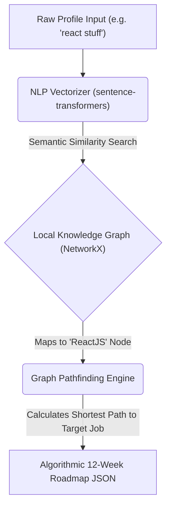

# 🚀 PLACEMENT PRO+

### Hybrid Neuro-Symbolic AI System for Personalized Career Roadmap Generation

---

## 📖 Overview

**Placement Pro+** is a cutting-edge, 100% offline Artificial Intelligence platform built to bridge the gap between academic preparation and enterprise industry requirements. It provides students with real-time placement probability scoring, highly automated company mapping, and **dynamically generated 12-week growth roadmaps**. 

Crucially, Placement Pro+ **functions completely free of any external APIs**. It utilizes a proprietary **Neuro-Symbolic Layer**, merging the semantic understanding of Vector embeddings with the flawless mathematical logic of Directed Acyclic Graphs (DAGs).

### ✨ Key Features
- 🧠 **Neuro-Symbolic Brain**: Zero API calls. Relies entirely on local `.pkl` NLP models and hard-math Graph Pathfinding algorithms.
- 📊 **Placement Prediction**: A weighted algorithmic model calculating probability against internships and parsed skills.
- 🕸️ **Semantic Skill Mapping**: Utilizes `all-MiniLM-L6-v2` to understand messy user text and map it to an official ontology.
- 🎯 **Algorithmic Pathfinding**: Uses `NetworkX` shortest-path rendering to construct foolproof logical learning milestones.
- ⚡ **Cyberpunk UI Engine**: Extremely responsive "immersion terminal" UI built on React, Framer Motion, and Tailwind CSS.
- 📉 **Real-Time Data Visualization**: Recharts integration mapping candidate topologies (Radar Charts) and probability growth curves.

---

## 🏗️ Technical Architecture

The AI layer merges two discrete disciplines of Machine Learning:

---

## 🚀 Deployment & Installation

### Option 1: Render.com 1-Click Deploy
The repository contains a fully configured `render.yaml` Infrastructure-as-Code (IaC) file. Push this repository to GitHub and synchronize it with Render to automatically launch both the Frontend Vite Static Site and the Python WSGI Backend using Gunicorn.

### Option 2: Local Execution

**Backend Setup**
1. Navigate to `/backend`.
2. Activate your virtual environment: `python -m venv venv`.
3. Install the AI dependencies: `pip install -r requirements.txt`. (Note: The first execution will download an ~80MB NLP HuggingFace Model to your cache).
4. Run: `python -m flask run` or `gunicorn run:app`.

**Frontend Setup**
1. Navigate to `/frontend`.
2. Install node properties: `npm install`.
3. Start the dev server: `npm run dev`.

---

  Built with mathematical precision by the <strong>sriiverse</strong> team.

